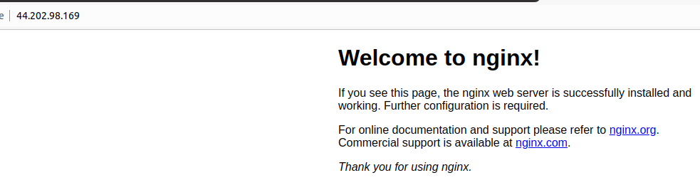

WEB STACK IMPLEMENTATION (LEMP STACK)

What is LEMP STACK?
LEMP is a variation of the ubiquitous LAMP stack used for developing and deploying web applications. Traditionally, LAMP consists of Linux, Apache, MySQL, and PHP. Due to its modular nature, the components can easily be swapped out. With LEMP, Apache is replaced with the lightweight yet powerful Nginx.

LEMP stands for Linux, Nginx, MySQL, PHP or Python, or Perl.

Preparing Prerequisites

Spinning up a new EC2 instance (an instance of a virtual server) is only a matter of a few clicks.

You can follow the instructions below to get yourself set up:

1) Register a new AWS account following this instruction.
2) Select your preferred region (the closest to you) and launch a new EC2 instance of t2.micro family with Ubuntu Server 20.04 LTS (HVM)

Important

Linux Linux is the operating system for this stack, and the flavor we will be using is Ubuntu.

Installling an OS

We will be utilising AWS service (Elastic Cloud Computing - EC2 instance) to create a server. To access this feature, you need to first create an account with AWS or sign in if you have an existing account

Click "Launch a virtual machine"

Type in the search bar Ubuntu Sever 20.01 LTS (HVM), SSD, click select.

Next, keep highlighted the selection in the image, and scroll down and click "Review and Launch"

On the next page click "Launch"

Create and save your key-pair pem file in a secure and accessible location. This will be needed to access your server from your local machine. Click "Download Key Pair" and then click "Launch Instances"

Click what's highlighted in red. Please note your number will be different.

Connecting to your EC2 instance using Terminal

- Change directory into the loacation where your `PEM` file is. Most likely will be in the **Downloads** folder

`cd ~/Downloads`

**IMPORTANT** - Anywhere you see these anchor tags **< >** , going forward, it means you will need to replace the content in there with values specific to your situation. For example, if we need you to replace the name you have saved the private key on your machine, we will write something like **< private-key-name >**.

If the private key you downloaded was named **my-private-key.pem** simply remove the anchor tags and insert **my-private-key.pem** in the command you are required to execute. Lets try this and follow the instructions below to get some work done.

- Change premissions for the private key file (.pem), otherwise you can get an error “Bad permissions”

`sudo chmod 0400 <private-key-name>.pem`

- Connect to the instance by running

`ssh -i <private-key-name>.pem ubuntu@<Public-IP-address>`

Congratulations! You have just created your very first Linux Server in the Cloud and our set up looks like this now: (You are the client)

Installing Nginx Web Server

The Nginx is a high performance web server which will help to display web pages. The use of apt package is crucial to install the Nginx web server.

Execute the following commands to install Nginx

-sudo apt update
-sudo apt install nginx -y

To verify that nginx was successfully installed and is running as a service in Ubuntu, run the following command:

- sudo systemctl status nginx

If it is green and running, meaning the Web Server has launched successfully.

Before we can receive any traffic by our Web Server, we need to open TCP port 80 which is the default port that web browsers use to access web pages on the Internet

As we know, we have TCP port 22 open by default on our EC2 machine to access it via SSH, so we need to add a rule to EC2 configuration to open inbound connection through port 80:

On your instance, go to the security group tab and edit the inbound rules

Click "Add Rule" and add entry as shown in the pic. 

After doing that click "Save Rules"

To test how our Nginx server can respond to requests from the Internet. Open a web browser of your choice and try to access following url:

http://<Public-IP-Address>:80

**2)Installing MySQL**

Nginx web server is up and running, now you need to install a Database Management System (DBMS). MySQL is an open source relational database management system for storing application data. This particular database system is very suitable for this project.

Type this command
-sudo apt install mysql-server -y

Start the interactive script by running this command
-sudo mysql_secure_installation

Validate Password Plugin configuration.

For the rest of the questions, press Y and hit the ENTER key at each prompt.
Please test if you are able to log in to the MYSQL console by typing:
- sudo mysql

To exit MySQL type:
exit

Your MySQL server is now installed and secured. Next, we will install PHP, the final component in the LEMP stack.

**3)Installing PHP**

Nginx installed to serve your content and MySQL installed to store and manage your data. Now you can install PHP to process code and generate dynamic content for the web server.

Rum these two commands to install the packages at once run:
- sudo apt install php-fpm php-mysql -y

You now have your PHP components installed. Next, you will configure Nginx to use them.

**4) Configuring Nginx to Use PHP Processor**

When using the Nginx web server, we can create server blocks (similar to virtual hosts in Apache) to encapsulate configuration details and host more than one domain on a single server. In this guide, we will use projectLEMP as an example domain name.

Create the root web directory for **your_domain** as follows:
- sudo mkdir /var/www/projectLEMP

Assign ownership of the directory with the $USER environment variable, which will reference your current system user:
-sudo chown -R $USER:$USER /var/www/projectLEMP

Open a new configuration file in Nginx’s sites-available directory using your preferred command-line editor.Here, we’ll use vi:
-sudo vi /etc/nginx/sites-available/projectLEMP

Inside the editor, paste the below:
server {
    listen 80;
    server_name projectLEMP www.projectLEMP;
    root /var/www/projectLEMP;

    index index.html index.htm index.php;

    location / {
        try_files $uri $uri/ =404;
    }

    location ~ \.php$ {
        include snippets/fastcgi-php.conf;
        fastcgi_pass unix:/var/run/php/php7.4-fpm.sock;
     }

    location ~ /\.ht {
        deny all;
    }

}

**save and quit**

Activate your configuration by linking to the config file from Nginx’s sites-enabled directory:

- sudo ln -s /etc/nginx/sites-available/projectLEMP /etc/nginx/sites-enabled/

Check for syntax error: You should see the following text
- sudo nginx -t

**If any errors are reported, go back to your configuration file to review its contents before continuing.**

**Next**
Disable default Nginx host that is currently configured to listen on port 80, for this run:
- sudo unlink /etc/nginx/sites-enabled/default

**Now**
Reload Nginx to apply the changes
- sudo systemctl reload nginx

Your new website is now active, but the web root /var/www/projectLEMP is still empty. Create an index.html file in that location so that we can test that your new server block works as expected:
- sudo echo 'Hello LEMP from hostname' $(curl -s http://169.254.169.254/latest/meta-data/public-hostname) 44.202.98.169 $(curl -s http://169.254.169.254/latest/meta-data/public-ipv4) > /var/www/projectLEMP/index.html

Go to your browser and type:
http://<Public-IP-Address>:80

**The screenshot shows that the text from the echo command we wrote to index.html file means the Nginx site is working as expected**

LEMP stack is now fully configured. In the next step, we’ll create a PHP script to test that Nginx is in fact able to handle .php files within your newly configured website.

**Step 5 – Testing PHP with Nginx**

Your LEMP stack should now be completely set up.

At this point, your LAMP stack is completely installed and fully operational.

You can test it to validate that Nginx can correctly hand `.php` files off to your PHP processor.

You can do this by creating a test PHP file in your document root. Open a new file called `info.php` within your document root in your text editor:

- vi /var/www/projectLEMP/info.php

Type or paste the following lines into the new file. This is valid PHP code that will return information about your server:

`<?php
phpinfo();`

Access this page in your web browser by visiting the domain name or public IP address you’ve set up in your Nginx configuration file, followed by /info.php:
http://`server_domain_or_IP`/info.php

You will see a web page containing detailed information about your server:

After checking the relevant information about your PHP server through that page, it’s best to remove the file you created as it contains sensitive information about your PHP environment and your Ubuntu server.
- sudo rm /var/www/your_domain/info.php

You can always regenerate this file if you need it in the future!

**Step 6 — Retrieving data from MySQL database with PHP**

We will create a database named **example_database** and a user named **example_user**, but you can replace these names with different values.

First, connect to the MySQL console using the **root** account:
- sudo mysql

To create a new database, run the following command from your MySQL console:

`mysql> CREATE DATABASE `example_database`;`

Now you can create a new user and grant him full privileges on the database you have just created.

The following command creates a new user named `example_user`, using mysql_native_password as default authentication method. We’re defining this user’s password as `password`, but you should replace this value with a secure password of your own choosing.

`mysql>  CREATE USER 'example_user'@'%' IDENTIFIED WITH mysql_native_password BY 'password';`

Now we need to give this user permission over the `example_database` database:

`mysql> GRANT ALL ON example_database.* TO 'example_user'@'%';`

This will give the **example_user** user full privileges over the **example_database** database, while preventing this user from creating or modifying other databases on your server.

Now exit the MySQL shell with:

`mysql> exit`

